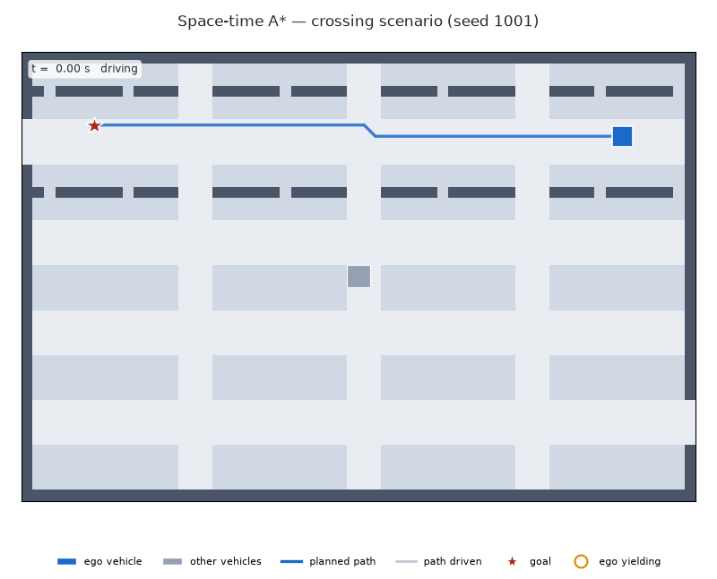
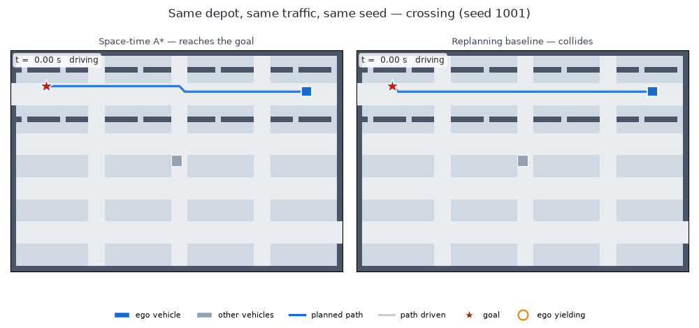

# Depot Planner

Motion planning for a vehicle depot seen from above: grid A\* for routing, space-time A\* for driving through moving traffic, and hybrid A\* for parking a car-shaped vehicle — with a seeded evaluation harness that scores all of it and an independent collision checker that audits every plan.

[](https://github.com/Neil456/depot-planner/actions/workflows/tests.yml)



## What this is

A depot is a hard, small planning problem: narrow aisles, parked cars, and other
vehicles crawling through the same lanes you need. This repository builds three
planners for that world and then spends most of its effort on the part that
usually gets skipped — measuring them. Every scenario comes from a seed, every
planner runs in closed loop against traffic that does not care about it, and
every trajectory is re-checked by a collision checker that shares no code with
any planner. When the checker and a planner disagree, the harness raises rather
than recording a pass. It has caught real bugs, which are listed below.

## Planners

**Grid A\*.** The depot becomes a 1 m grid: aisles are cheap, parking areas cost
three times as much, walls and curbs are not drivable, and a soft penalty near
obstacles keeps routes off the paintwork. One search routine covers Dijkstra (no
guidance), A\* (guided by an octile distance scaled so it can never overestimate,
so the route stays optimal) and weighted A\* (guidance exaggerated by 1.5×, which
finds a slightly worse route far faster).

**Space-time A\*.** Traffic moves, so a plan has to say *where* and *when*. This
searches over `(x, y, time)` and can choose to **wait** in place for a step.
Waiting costs something, so it only waits when that beats going around. It will
not enter a cell a vehicle will occupy at that instant, keeps a one-cell buffer
around every vehicle, and will not swap places with one.

**The replanning baseline.** The honest straw man. Plain grid A\*, treating other
vehicles as walls standing wherever they are at this instant, replanning every
single step. It is orders of magnitude cheaper and often fine — but it has no idea
anything is moving, so it drives into the gap a crossing vehicle is about to
fill.

**Hybrid A\*.** For parking, the ego stops being a dot and becomes a 4.5 × 1.9 m
car with a 2.7 m wheelbase that steers like a car. The search expands 1 m arcs at
five steering angles, forward and in reverse, paying extra for reversing and for
changing direction. The body is covered with four discs checked against a
distance field of the obstacles. Because 1 m arcs will essentially never land
exactly on a target pose, the search periodically fires a **Reeds-Shepp curve**
at the goal and takes it if it is collision-free.

The two space-time planners on the same depot, the same traffic and the same
seed:



## Results

Everything below is generated from the CSVs the batteries write — see
[REPORT.md](REPORT.md) for the full tables, the plots, and every failure case
with the frame where it failed.

### Grid search, 100 start/goal pairs

Timed on whichever backend is the default here; the `backend` column says which,
and the [C++ core](#c-core) section below compares the two directly.

<!-- BEGIN GENERATED: grid_table -->
| algorithm | backend | cost / optimal | nodes expanded | mean ms |
| :-- | :-- | :-- | :-- | :-- |
| Dijkstra | cpp | 1.0000 | 1479 | 0.26 |
| A* | cpp | 1.0000 | 348 | 0.08 |
| Weighted A* (w=1.5) | cpp | 1.0297 | 96 | 0.03 |
<!-- END GENERATED: grid_table -->

A\* and Dijkstra agree on cost to the last decimal on every pair, which is the
admissibility check; A\* just gets there having looked at a quarter as much.

### Space-time A\* vs the baseline — normal tier

Five scenario types, 30 episodes each, both planners on the same seeded
scenarios.

<!-- BEGIN GENERATED: spacetime_normal -->
| scenario | planner | success % | collisions | timeouts | mean waits | mean plan ms |
| :-- | :-- | :-- | :-- | :-- | :-- | :-- |
| empty | spacetime_astar | 100.0 | 0 | 0 | 0.0 | 0.07 |
| empty | baseline_replan | 100.0 | 0 | 0 | 0.0 | 0.05 |
| crossing | spacetime_astar | 100.0 | 0 | 0 | 2.7 | 0.07 |
| crossing | baseline_replan | 83.3 | 5 | 0 | 0.2 | 0.05 |
| head_on | spacetime_astar | 100.0 | 0 | 0 | 1.3 | 0.18 |
| head_on | baseline_replan | 100.0 | 0 | 0 | 0.0 | 0.06 |
| blocked_then_clears | spacetime_astar | 100.0 | 0 | 0 | 9.6 | 0.14 |
| blocked_then_clears | baseline_replan | 100.0 | 0 | 0 | 0.0 | 0.05 |
| congested | spacetime_astar | 100.0 | 0 | 0 | 9.4 | 0.42 |
| congested | baseline_replan | 93.3 | 2 | 0 | 1.8 | 0.08 |
<!-- END GENERATED: spacetime_normal -->

### Hard tier

`congested_hard` puts 12–16 vehicles in the depot; `head_on_narrow` shrinks the
aisles to three cells, where one vehicle plus its safety buffer fills the lane
completely. Both planners also get a hard wall-clock budget per replan, so this
is the one tier where how fast the planner runs changes what it achieves.
Running on the C++ core:

<!-- BEGIN GENERATED: spacetime_hard -->
| scenario | planner | success % | collisions | timeouts | mean waits | mean plan ms |
| :-- | :-- | :-- | :-- | :-- | :-- | :-- |
| congested_hard | spacetime_astar | 100.0 | 0 | 0 | 15.3 | 3.11 |
| congested_hard | baseline_replan | 66.7 | 10 | 0 | 6.3 | 0.09 |
| head_on_narrow | spacetime_astar | 100.0 | 0 | 0 | 3.1 | 0.52 |
| head_on_narrow | baseline_replan | 100.0 | 0 | 0 | 0.0 | 0.07 |
<!-- END GENERATED: spacetime_hard -->

And the identical tier on the pure-Python reference — same scenarios, same
seeds, same budget, the slower implementation:

<!-- BEGIN GENERATED: spacetime_hard_python -->
| scenario | planner | success % | collisions | timeouts | mean waits | mean plan ms |
| :-- | :-- | :-- | :-- | :-- | :-- | :-- |
| congested_hard | spacetime_astar | 63.3 | 2 | 9 | 60.7 | 29.15 |
| congested_hard | baseline_replan | 66.7 | 10 | 0 | 6.3 | 1.21 |
| head_on_narrow | spacetime_astar | 50.0 | 0 | 15 | 107.8 | 28.73 |
| head_on_narrow | baseline_replan | 100.0 | 0 | 0 | 0.0 | 1.46 |
<!-- END GENERATED: spacetime_hard_python -->

<!-- BEGIN GENERATED: finding_budget -->
**Under a 50 ms budget per replan, the implementation decides the outcome.** Space-time A\* on the C++ core reaches the goal in 100.0% of `congested_hard` episodes and 100.0% of `head_on_narrow` episodes. The same planner on the Python reference, with the same budget and the same seeds, manages 63.3% of `congested_hard` with 9 timeouts and 50.0% of `head_on_narrow` with 15 timeouts: the search does not fit in the budget, returns no plan, and the ego stalls in the aisle until the episode times out. The replanning baseline is cheap enough either way and is unmoved at 66.7% and 100.0%, but on `congested_hard` it fails by driving into vehicles (10 collisions) rather than by running out of time. Optimality is worthless if it does not fit in the control loop — and here making it fit was an implementation problem, not an algorithmic one.
<!-- END GENERATED: finding_budget -->

### Hybrid A\* parking

Four types in the normal tier, 30 scenarios each. Every successful plan is
re-verified by the independent exact-rectangle checker.

<!-- BEGIN GENERATED: parking_normal -->
| parking type | success % | mean plan ms | nodes expanded | direction switches |
| :-- | :-- | :-- | :-- | :-- |
| perpendicular_forward | 100.0 | 7.4 | 1448 | 1.10 |
| perpendicular_reverse | 100.0 | 3.3 | 623 | 0.73 |
| parallel | 100.0 | 34.8 | 6372 | 2.83 |
| tight | 100.0 | 19.5 | 3973 | 2.47 |
<!-- END GENERATED: parking_normal -->

Two minimal-clearance types in the hard tier, 30 scenarios each:

<!-- BEGIN GENERATED: parking_hard -->
| parking type | success % | mean plan ms | nodes expanded | direction switches |
| :-- | :-- | :-- | :-- | :-- |
| parallel_minimal | 33.3 | 19.5 | 4029 | 1.50 |
| perpendicular_minimal | 96.7 | 5.6 | 1092 | 0.72 |
<!-- END GENERATED: parking_hard -->

<!-- BEGIN GENERATED: finding_gaps -->
**Parallel parking falls apart in minimal gaps.** The narrowest gap this collision model accepts for a 4.5 m car is 5.72 m, computed from the geometry rather than picked by hand. Given gaps of only 6.02–6.32 m and a 5000-expansion cap, `parallel_minimal` succeeds 33.3% of the time against 96.7% for `perpendicular_minimal`, which needs far less search.
<!-- END GENERATED: finding_gaps -->

Nothing was tuned after the hard tier was first run.

## Bugs found by the evaluation harness

Three defects the harness caught that reading the code did not. All are fixed;
the reasoning is in [docs/DECISIONS.md](docs/DECISIONS.md).

**A 1 cm clip through a parked car.** The first parking battery run aborted: the
planner returned a path the independent checker rejected. `distance_transform_edt`
measures centre-to-centre and a lookup snaps the query to its cell, so the
distance field was reporting up to a full cell diagonal more clearance than
existed — enough for a plan to shave a parked car's corner. Fixed at the source
by storing `max(edt - √2, 0) · resolution`, which makes the stored value a true
lower bound, rather than by loosening the checker.

**The C++ port diverged on paths, not costs.** The C++ core matched the Python
search's cost on every one of 600 comparisons but returned a different path on 34
of them. The Python heap pushes `(f, g, counter, cell)`, so ties on `f` break
towards the smaller `g`; the C++ comparator only had `(f, order)`. A test now
pins path, cost and expansion count together, which is what caught it.

**Failure frames showing the wrong moment.** The runner handed the collision
checker a two-step window, so the recorded collision index was always 0 or 1
instead of a position in the trajectory — every failure image in the report was
rendering the wrong frame. Found only when the images were first looked at.

## C++ core

All three planners are a C++17 library under `cpp/` (`depot_core`), exposed
through pybind11 and built by `pip install -e .` via scikit-build-core. Python
keeps what it is good at: scenario generation, the closed-loop orchestration,
the two independent collision checkers, plotting and reports. The pure-Python
planners stay in the tree as the **reference implementation** and still run on
`--backend python`; every C++ plan is verified against them.

Each case below is run five times per backend and the median kept, on the same
prepared inputs with scenario setup excluded from the clock.

<!-- BEGIN GENERATED: cpp_table -->
| planner | cases | Python ms | C++ ms | speedup | identical plans |
| :-- | :-- | :-- | :-- | :-- | :-- |
| grid A* (Dijkstra) | 40 | 9.0459 | 0.2947 | 30.4 | yes |
| grid A* | 40 | 1.7967 | 0.0864 | 22.5 | yes |
| grid A* (weighted, w=1.5) | 40 | 0.5276 | 0.0480 | 11.6 | yes |
| space-time A* | 10 | 35.5036 | 0.8480 | 41.0 | yes |
| hybrid A* | 8 | 212.9811 | 8.1482 | 25.0 | yes |
<!-- END GENERATED: cpp_table -->

## Quickstart

```bash
pip install -e ".[dev]"   # builds the C++ core via scikit-build-core
make test                 # the test suite
make all                  # setup, tests, batteries, GIFs and the report (~12 min)
```

Individual stages: `make step1`, `make battery`, `make gifs`, `make report`.
Every tunable number — costs, penalties, resolutions, limits, scenario
parameters — lives in `configs/*.yaml`, never in the code.

## Layout

```
depot_planner/
  world/        maps, cost maps, moving-agent scenarios, parking scenarios
  grid_astar/   the generic best-first search and the C++ backend dispatch
  spacetime/    (x, y, t) search and the two planner wrappers
  hybrid/       car model, distance-field collision, Reeds-Shepp, hybrid A*
  sim/          closed-loop runner and two independent collision checkers
  viz/          top-down renderer, episode GIFs, parking GIFs, showcase GIFs
  eval/         batteries, benchmarks, report and README generation
cpp/
  include/depot/  public headers of the C++17 planning core
  src/            its implementation
  bindings/       the pybind11 module (depot_planner._cpp)
  tests/          GoogleTest suite
  bench/          Google Benchmark suite
configs/        every tunable parameter
scripts/        one CLI entry point per Makefile target
tests/          the test suite
docs/           the original brief, progress log and decision log
results/        generated; gitignored except results/README_assets/
```

[docs/DECISIONS.md](docs/DECISIONS.md) records every judgement call and why.
[docs/PROGRESS.md](docs/PROGRESS.md) tracks what is done. [docs/TASK.md](docs/TASK.md)
is the original brief this was built against.

## Limitations

Worth being straight about what these scenarios do and do not model.

- **Other vehicles' trajectories are known exactly and never react.** Each agent
  follows a timeline fixed before planning starts. That is what makes space-time
  A\* clean and also what makes it optimistic: no prediction error, no
  negotiation, no vehicle braking because the ego moved. Real prediction
  uncertainty would need a different formulation.
- **The traffic world is a grid.** Until the parking step the ego is a point that
  moves one cell per step; it has no shape, no heading and no acceleration limit.
  The grid is 1 m and the timestep 0.25 s, so a "collision" is a cell overlap,
  not a swept-volume intersection.
- **The car model is kinematic, not dynamic.** Hybrid A\* respects the steering
  limit and the wheelbase, but there is no mass, no tyre slip, no jerk limit and
  no speed profile — the plan is a geometric path, not a trajectory a controller
  could track directly.
- **Hybrid A\* is not claimed to be optimal.** Its obstacle-aware grid heuristic
  is the standard one and is not a proven lower bound in every obstacle layout,
  and the Reeds-Shepp word set covers the CSC, CCC and SCS families rather than
  all 48 words.
- **The hard tier's wall-clock budget is not bit-reproducible.** How much search
  fits in 50 ms depends on the machine. Re-running it left every
  success/collision/timeout value identical but moved the per-episode expansion
  counts; see REPORT.md.
