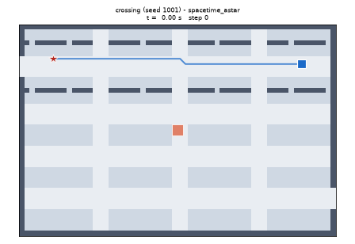
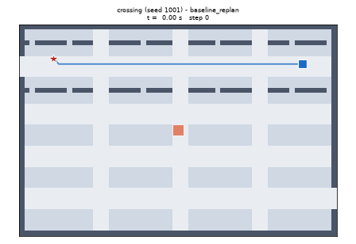
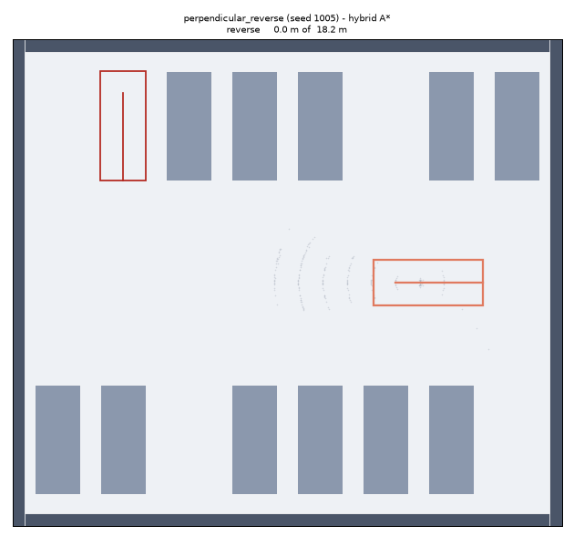

# Depot Maneuvering Planners

Three planners for a vehicle depot seen from above, built in one pass and tested
end to end: **grid A\*** for routing, **space-time A\*** for driving through
moving traffic, and **hybrid A\*** for parking a car-shaped vehicle into a spot.

Everything is seeded and reproducible: the same seed gives the same depot, the
same traffic, the same plan and the same numbers. Full results are in
**[REPORT.md](REPORT.md)**, generated from the CSVs the batteries write.

---

### Space-time A\* waits for crossing traffic



It knows where the other vehicle will be at every future instant, so it pauses,
lets it pass, and carries on.

### The baseline collides on the very same scenario



Same map, same seed, same traffic. This planner only sees where vehicles are
*right now*, so it drives into the gap the crossing vehicle is about to occupy.

### Hybrid A\* reverses into a parking spot



A real car cannot slide sideways. This planner searches over steering arcs,
forwards and in reverse, and ends within 0.3 m and 5° of the target pose.

---

## What each planner actually does

**Grid A\* (step 1).** The depot is a 1 m grid of cells: aisles are cheap to
drive on, parking areas cost three times as much, and walls and curbs are not
drivable at all. A soft penalty near obstacles keeps routes off the paintwork.
One search routine covers all three classic variants — Dijkstra (no guidance),
A\* (guided by an octile distance that can never overestimate, so the answer is
still optimal) and weighted A\* (guidance exaggerated by 1.5×, which finds a
slightly worse route much faster).

**Space-time A\* (step 3).** Other vehicles move, so a plan needs to say *where*
and *when*. This planner searches over `(x, y, time)` and can choose to **wait**
in place for a step. Waiting costs a little, so it only waits when that beats
going around. It refuses to enter any cell an agent will occupy at that instant,
keeps a one-cell buffer around every vehicle, and will not swap places with one.

**The replanning baseline (step 3).** The honest straw man. It runs plain grid
A\*, treats the other vehicles as walls standing where they are at this instant,
and replans every single step. It is much cheaper and it is often fine — but it
has no idea anything is moving.

**The closed-loop simulator (step 4).** Plans are not results. The runner makes
the ego actually drive: it replans on a fixed cadence, executes the next few
steps, lets the traffic follow its own timeline, and checks every executed step
against a collision checker that shares no code with any planner. An episode
ends at the goal, at a collision, or at the time limit.

**Hybrid A\* (step 5).** For parking, the ego stops being a dot and becomes a
4.5 × 1.9 m car with a 2.7 m wheelbase that steers like a car. The search
expands 1 m arcs at five steering angles, forwards and in reverse, and pays
extra for reversing and for changing direction. The car's body is covered with
four discs checked against a distance field of the obstacles. Because 1 m arcs
will essentially never land exactly on a target pose, the search periodically
fires a **Reeds-Shepp curve** at the goal and takes it if it is collision-free.

## Difficulty tiers

Both batteries run two tiers. The **normal tier** is the one the original spec
describes. The **hard tier** was added afterwards to find the edges:

- space-time: 12–16 vehicles instead of 6–10, aisles narrowed to three cells
  (where a vehicle plus its safety buffer fills the lane completely), and a hard
  50 ms budget on every replan;
- parking: gaps only 0.3–0.6 m wider than the narrowest the collision model can
  accept (a number computed from the car geometry, not chosen by hand), and the
  search capped at 5 000 expansions instead of 30 000.

Nothing was tuned afterwards to improve the hard-tier scores. What it found —
including a case where the cheap baseline beats the expensive planner — is in
[REPORT.md](REPORT.md), with every failure listed and diagnosed.

## Running it

```bash
make setup      # pip install -e ".[dev]"
make test       # the test suite
make step1      # results/step1/compare.png: Dijkstra vs A* vs weighted A*
make battery    # both batteries, both tiers, writing results/*.csv
make gifs       # every GIF and demo figure under results/
make report     # regenerates REPORT.md from those CSVs
make all        # all of the above, in order
```

Every tunable number — costs, penalties, resolutions, limits, scenario
parameters — lives in `configs/*.yaml`, never in the code.

## Layout

```
depot_planner/
  world/        maps, cost maps, moving-agent scenarios, parking scenarios
  grid_astar/   step 1: the generic best-first search
  spacetime/    step 3: (x, y, t) search and the two planner wrappers
  hybrid/       step 5: car model, distance-field collision, Reeds-Shepp, hybrid A*
  sim/          closed-loop runner and two independent collision checkers
  viz/          top-down renderer, episode GIFs, parking GIFs
  eval/         batteries, the step-1 benchmark, report helpers
scripts/        one CLI entry point per Makefile target
configs/        every tunable parameter
tests/          the test suite
results/        generated; gitignored except results/README_assets/
```

`PROGRESS.md` says what is done and what is not. `DECISIONS.md` records every
judgement call and why it was made, including the bugs this process caught.
