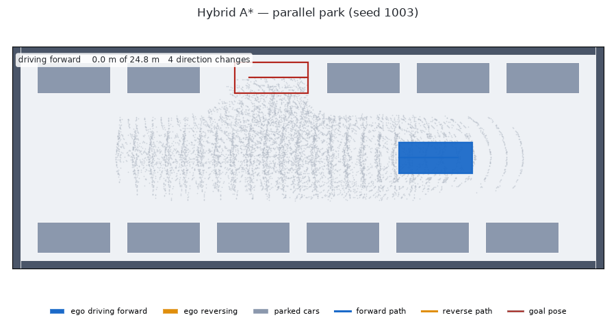

# Depot Planner

Motion planning for a vehicle depot seen from above: grid A\* for routing, space-time A\* for driving through moving traffic, and hybrid A\* for parking a car-shaped vehicle — with a seeded evaluation harness that scores all of it and an independent collision checker that audits every plan.

[](https://github.com/Neil456/depot-planner/actions/workflows/tests.yml)


## What this is

A depot is a hard, small planning problem: narrow aisles, parked cars, and other
vehicles crawling through the same lanes you need. This repository builds three
planners for that world and then spends most of its effort on the part that
usually gets skipped — measuring them. Every scenario comes from a seed, every
planner runs in closed loop against traffic that does not care about it, and
every trajectory is re-checked by a collision checker that shares no code with
any planner. When the checker and a planner disagree, the harness raises rather
than recording a pass. It has caught real bugs, which are listed below.

## Planners

**Grid A\*.** The depot becomes a 1 m grid: aisles are cheap, parking areas cost
three times as much, walls and curbs are not drivable, and a soft penalty near
obstacles keeps routes off the paintwork. One search routine covers Dijkstra (no
guidance), A\* (guided by an octile distance scaled so it can never overestimate,
so the route stays optimal) and weighted A\* (guidance exaggerated by 1.5×, which
finds a slightly worse route far faster).

**Space-time A\*.** Traffic moves, so a plan has to say *where* and *when*. This
searches over `(x, y, time)` and can choose to **wait** in place for a step.
Waiting costs something, so it only waits when that beats going around. It will
not enter a cell a vehicle will occupy at that instant, keeps a one-cell buffer
around every vehicle, and will not swap places with one.

**The replanning baseline.** The honest straw man. Plain grid A\*, treating other
vehicles as walls standing wherever they are at this instant, replanning every
single step. It is orders of magnitude cheaper and often fine — but it has no idea
anything is moving, so it drives into the gap a crossing vehicle is about to
fill.

**Hybrid A\*.** For parking, the ego stops being a dot and becomes a 4.5 × 1.9 m
car with a 2.7 m wheelbase that steers like a car. The search expands 1 m arcs at
five steering angles, forward and in reverse, paying extra for reversing and for
changing direction. The body is covered with four discs checked against a
distance field of the obstacles. Because 1 m arcs will essentially never land
exactly on a target pose, the search periodically fires a **Reeds-Shepp curve**
at the goal and takes it if it is collision-free.

Reversing into a parallel bay barely longer than the car. The overlay counts the
forward/reverse switches; every pose along the path is re-checked against the
exact car rectangle by a checker that shares no code with the planner:



And the two space-time planners on the same depot, the same traffic and the same
seed:


## Results

Everything below is generated from the CSVs the batteries write — see
[REPORT.md](REPORT.md) for the full tables, the plots, and every failure case
with the frame where it failed.

### Grid search, 100 start/goal pairs

Timed on whichever backend is the default here; the `backend` column says which,
and the [C++ core](#c-core) section below compares the two directly.

<!-- BEGIN GENERATED: grid_table -->
| algorithm | backend | cost / optimal | nodes expanded | mean ms |
| :-- | :-- | :-- | :-- | :-- |
| Dijkstra | cpp | 1.0000 | 1479 | 0.27 |
| A* | cpp | 1.0000 | 348 | 0.08 |
| Weighted A* (w=1.5) | cpp | 1.0297 | 96 | 0.03 |
<!-- END GENERATED: grid_table -->

A\* and Dijkstra agree on cost to the last decimal on every pair, which is the
admissibility check; A\* just gets there having looked at a quarter as much.

### Space-time A\* vs the baseline — normal tier

Five scenario types, 30 episodes each, both planners on the same seeded
scenarios.

<!-- BEGIN GENERATED: spacetime_normal -->
| scenario | planner | success % | collisions | timeouts | mean waits | mean plan ms |
| :-- | :-- | :-- | :-- | :-- | :-- | :-- |
| empty | spacetime_astar | 100.0 | 0 | 0 | 0.0 | 2.22 |
| empty | baseline_replan | 100.0 | 0 | 0 | 0.0 | 0.07 |
| crossing | spacetime_astar | 100.0 | 0 | 0 | 2.7 | 2.54 |
| crossing | baseline_replan | 83.3 | 5 | 0 | 0.2 | 0.07 |
| head_on | spacetime_astar | 100.0 | 0 | 0 | 1.3 | 6.87 |
| head_on | baseline_replan | 100.0 | 0 | 0 | 0.0 | 0.09 |
| blocked_then_clears | spacetime_astar | 100.0 | 0 | 0 | 9.6 | 5.28 |
| blocked_then_clears | baseline_replan | 100.0 | 0 | 0 | 0.0 | 0.08 |
| congested | spacetime_astar | 100.0 | 0 | 0 | 9.4 | 22.75 |
| congested | baseline_replan | 93.3 | 2 | 0 | 1.8 | 0.14 |
<!-- END GENERATED: spacetime_normal -->

### Hard tier

`congested_hard` puts 12–16 vehicles in the depot; `head_on_narrow` shrinks the
aisles to three cells, where one vehicle plus its safety buffer fills the lane
completely. Both planners also get a hard wall-clock budget per replan.

<!-- BEGIN GENERATED: spacetime_hard -->
| scenario | planner | success % | collisions | timeouts | mean waits | mean plan ms |
| :-- | :-- | :-- | :-- | :-- | :-- | :-- |
| congested_hard | spacetime_astar | 66.7 | 1 | 9 | 61.5 | 28.19 |
| congested_hard | baseline_replan | 66.7 | 10 | 0 | 6.3 | 0.18 |
| head_on_narrow | spacetime_astar | 53.3 | 0 | 14 | 106.5 | 28.56 |
| head_on_narrow | baseline_replan | 100.0 | 0 | 0 | 0.0 | 0.10 |
<!-- END GENERATED: spacetime_hard -->

<!-- BEGIN GENERATED: finding_budget -->
**Under a 50 ms budget per replan, the cheap planner wins in narrow aisles.** On `head_on_narrow` the replanning baseline reaches the goal in 100.0% of episodes while space-time A* manages 53.3%, losing 14 of them to timeouts: the space-time search does not fit in the budget, returns no plan, and the ego stalls in the aisle. On `congested_hard` the two tie on success rate (66.7% against 66.7%), but they fail in opposite ways — space-time A* loses 9 episodes to timeouts and 1 episode to a collision, the baseline 10 episodes to collisions and 0 episodes to timeouts. A planner that cannot answer inside the control loop is not safe, it is just differently unsafe.
<!-- END GENERATED: finding_budget -->

### Hybrid A\* parking

Four types in the normal tier, 30 scenarios each. Every successful plan is
re-verified by the independent exact-rectangle checker.

<!-- BEGIN GENERATED: parking_normal -->
| parking type | success % | mean plan ms | nodes expanded | direction switches |
| :-- | :-- | :-- | :-- | :-- |
| perpendicular_forward | 100.0 | 186.3 | 1448 | 1.10 |
| perpendicular_reverse | 100.0 | 77.3 | 623 | 0.73 |
| parallel | 100.0 | 814.6 | 6372 | 2.83 |
| tight | 100.0 | 484.4 | 3973 | 2.47 |
<!-- END GENERATED: parking_normal -->

Two minimal-clearance types in the hard tier, 30 scenarios each:

<!-- BEGIN GENERATED: parking_hard -->
| parking type | success % | mean plan ms | nodes expanded | direction switches |
| :-- | :-- | :-- | :-- | :-- |
| parallel_minimal | 33.3 | 513.5 | 4029 | 1.50 |
| perpendicular_minimal | 96.7 | 133.6 | 1092 | 0.72 |
<!-- END GENERATED: parking_hard -->

<!-- BEGIN GENERATED: finding_gaps -->
**Parallel parking falls apart in minimal gaps.** The narrowest gap this collision model accepts for a 4.5 m car is 5.72 m, computed from the geometry rather than picked by hand. Given gaps of only 6.02–6.32 m and a 5000-expansion cap, `parallel_minimal` succeeds 33.3% of the time against 96.7% for `perpendicular_minimal`, which needs far less search.
<!-- END GENERATED: finding_gaps -->

Nothing was tuned after the hard tier was first run.

## C++ core

`cpp/grid_astar.cpp` is a C++17 port of the grid search exposed through pybind11,
with the same neighbourhood, cost rule, heuristic and tie-breaking. It is
optional: without a compiler the build warns and the pure-Python search is used
instead. Best of three runs per problem, on the same 100 start/goal pairs as the
grid table in Results.

<!-- BEGIN GENERATED: cpp_table -->
| algorithm | Python ms | C++ ms | speedup | identical paths |
| :-- | :-- | :-- | :-- | :-- |
| Dijkstra | 8.7508 | 0.2976 | 29.4 | yes |
| A* | 2.4582 | 0.1036 | 22.3 | yes |
| Weighted A* (w=1.5) | 0.7679 | 0.0517 | 13.5 | yes |
<!-- END GENERATED: cpp_table -->

## Quickstart

```bash
pip install -e ".[dev]"   # also builds the optional C++ core
make test                 # the test suite
make all                  # setup, tests, batteries, GIFs and the report (~12 min)
```

Individual stages: `make step1`, `make battery`, `make gifs`, `make report`.
Every tunable number — costs, penalties, resolutions, limits, scenario
parameters — lives in `configs/*.yaml`, never in the code.

## Layout

```
depot_planner/
  world/        maps, cost maps, moving-agent scenarios, parking scenarios
  grid_astar/   the generic best-first search and the C++ backend dispatch
  spacetime/    (x, y, t) search and the two planner wrappers
  hybrid/       car model, distance-field collision, Reeds-Shepp, hybrid A*
  sim/          closed-loop runner and two independent collision checkers
  viz/          top-down renderer, episode GIFs, parking GIFs, showcase GIFs
  eval/         batteries, benchmarks, report and README generation
cpp/            the optional C++17 core
configs/        every tunable parameter
scripts/        one CLI entry point per Makefile target
tests/          the test suite
docs/           design notes
results/        generated; gitignored except results/README_assets/
```
