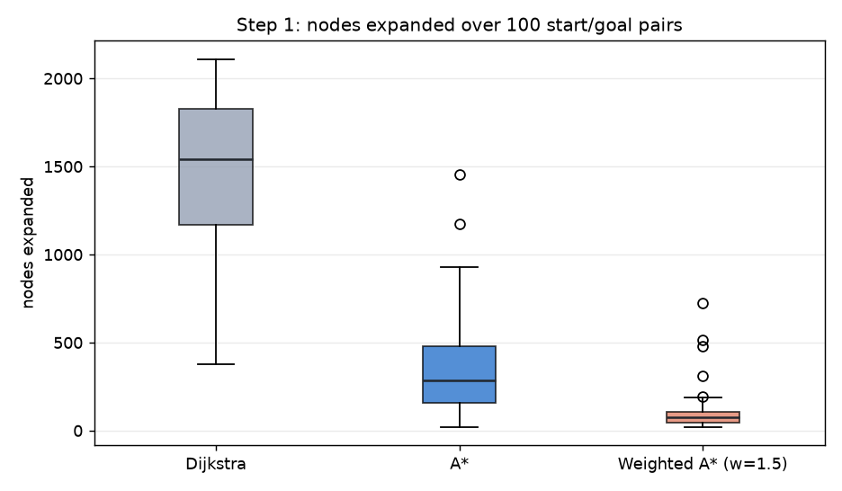
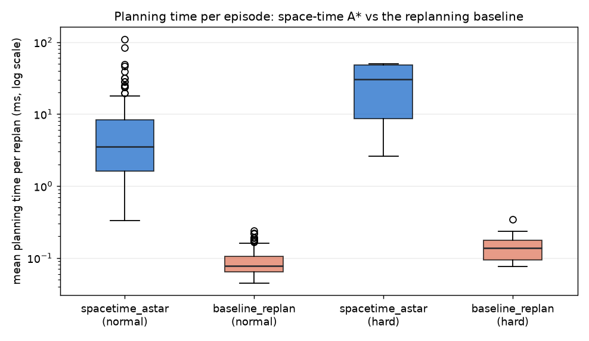

# Depot Maneuvering Planners — Report

Generated by `scripts/make_report.py` on 2026-09-22 08:17 UTC. Every number below is read from a CSV under `results/` that was produced by running the code; nothing is hardcoded. Regenerate with `make battery && make report`.

## 1. Grid search: Dijkstra vs A* vs weighted A*

100 random start/goal pairs on one depot map (`configs/eval.yaml: grid_benchmark`), all three algorithms on every pair. These runs use whichever backend is the default here — the `backend` column says which — so compare the timings against section 7 rather than across sections.

| algorithm | backend | mean path cost | mean cost / optimal | worst cost / optimal | mean nodes expanded | max nodes expanded | mean ms | max ms |
| :-- | :-- | :-- | :-- | :-- | :-- | :-- | :-- | :-- |
| Dijkstra | cpp | 44.436 | 1.0000 | 1.0000 | 1479 | 2109 | 0.27 | 0.40 |
| A* | cpp | 44.436 | 1.0000 | 1.0000 | 348 | 1453 | 0.08 | 0.32 |
| Weighted A* (w=1.5) | cpp | 45.788 | 1.0297 | 1.1463 | 96 | 726 | 0.03 | 0.18 |

A* and Dijkstra return the same cost on every pair (cost ratio 1.0000), which is the admissibility check from step 1. Weighted A* trades a small amount of optimality for a large cut in expansions.

## 2. Space-time A* vs the replanning baseline

### Normal tier

Five scenario types, 30 episodes each, both planners on the same seeded scenarios. Space-time A* replans every 4 steps; the baseline replans every step and treats the agents as static obstacles where they currently are.

| scenario | planner | episodes | success % | collisions | timeouts | mean time to goal (s) | mean wait steps | mean plan ms | max plan ms |
| :-- | :-- | :-- | :-- | :-- | :-- | :-- | :-- | :-- | :-- |
| empty | spacetime_astar | 30 | 100.0 | 0 | 0 | 10.86 | 0.0 | 2.22 | 40.7 |
| empty | baseline_replan | 30 | 100.0 | 0 | 0 | 10.86 | 0.0 | 0.07 | 0.3 |
| crossing | spacetime_astar | 30 | 100.0 | 0 | 0 | 11.11 | 2.7 | 2.54 | 26.7 |
| crossing | baseline_replan | 30 | 83.3 | 5 | 0 | 12.47 | 0.2 | 0.07 | 0.3 |
| head_on | spacetime_astar | 30 | 100.0 | 0 | 0 | 10.94 | 1.3 | 6.87 | 145.7 |
| head_on | baseline_replan | 30 | 100.0 | 0 | 0 | 11.02 | 0.0 | 0.09 | 0.5 |
| blocked_then_clears | spacetime_astar | 30 | 100.0 | 0 | 0 | 13.24 | 9.6 | 5.28 | 82.9 |
| blocked_then_clears | baseline_replan | 30 | 100.0 | 0 | 0 | 11.00 | 0.0 | 0.08 | 0.3 |
| congested | spacetime_astar | 30 | 100.0 | 0 | 0 | 12.61 | 9.4 | 22.75 | 539.2 |
| congested | baseline_replan | 30 | 93.3 | 2 | 0 | 11.94 | 1.8 | 0.14 | 0.6 |

### Hard tier

Two harder scenario types, 30 episodes each, seeds offset to 5000: `congested_hard` puts [12, 16] agents in the depot, and `head_on_narrow` shrinks the aisles to 3 cells (a 2-cell vehicle plus its 1-cell margin fills one completely). Both planners additionally get a hard budget of 50 ms per replan, one fifth of the 250 ms simulation step.

| scenario | planner | episodes | success % | collisions | timeouts | mean time to goal (s) | mean wait steps | mean plan ms | max plan ms |
| :-- | :-- | :-- | :-- | :-- | :-- | :-- | :-- | :-- | :-- |
| congested_hard | spacetime_astar | 30 | 66.7 | 1 | 9 | 12.11 | 61.5 | 28.19 | 75.1 |
| congested_hard | baseline_replan | 30 | 66.7 | 10 | 0 | 12.55 | 6.3 | 0.18 | 0.6 |
| head_on_narrow | spacetime_astar | 30 | 53.3 | 0 | 14 | 15.31 | 106.5 | 28.56 | 73.3 |
| head_on_narrow | baseline_replan | 30 | 100.0 | 0 | 0 | 11.53 | 0.0 | 0.10 | 0.4 |

## 3. Hybrid A* parking

### Normal tier

Four parking types, 30 scenarios each. Every successful plan is re-verified by the independent exact-rectangle checker in `depot_planner/sim/car_collision.py`.

| parking type | scenarios | success % | mean plan ms | max plan ms | mean nodes expanded | mean direction switches | mean path (m) |
| :-- | :-- | :-- | :-- | :-- | :-- | :-- | :-- |
| perpendicular_forward | 30 | 100.0 | 186.3 | 619.5 | 1448 | 1.10 | 14.57 |
| perpendicular_reverse | 30 | 100.0 | 77.3 | 524.4 | 623 | 0.73 | 15.64 |
| parallel | 30 | 100.0 | 814.6 | 1880.0 | 6372 | 2.83 | 18.93 |
| tight | 30 | 100.0 | 484.4 | 2224.6 | 3973 | 2.47 | 16.33 |

### Hard tier

Two minimal-clearance types, 30 scenarios each. The gap (or spot width) is drawn from `minimum + 0.3 .. 0.6 m`, where the minimum is computed from the car geometry and the collision model in `world/parking.py`, not written down by hand. The search is also capped at 5000 expansions instead of 30000.

| parking type | scenarios | success % | mean plan ms | max plan ms | mean nodes expanded | mean direction switches | mean path (m) |
| :-- | :-- | :-- | :-- | :-- | :-- | :-- | :-- |
| parallel_minimal | 30 | 33.3 | 513.5 | 671.7 | 4029 | 1.50 | 16.17 |
| perpendicular_minimal | 30 | 96.7 | 133.6 | 606.4 | 1092 | 0.72 | 14.43 |

## 4. Failure cases

62 of the 600 runs across both batteries did not reach the goal. Every one is listed here with the frame where it failed.

| tier | scenario | planner | seed | outcome | frame | diagnosis |
| :-- | :-- | :-- | --: | :-- | :-- | :-- |
| normal | crossing | baseline_replan | 1001 | collision | [frame](results/README_assets/report/failure_normal_crossing_baseline_replan_seed1001.png) | overlap at step 30 (t=30) cell (30, 1) agent 0; the plan it was executing was 1 steps old and had frozen that agent where it stood when the plan was made |
| normal | crossing | baseline_replan | 1002 | collision | [frame](results/README_assets/report/failure_normal_crossing_baseline_replan_seed1002.png) | overlap at step 41 (t=41) cell (39, 38) agent 0; the plan it was executing was 1 steps old and had frozen that agent where it stood when the plan was made |
| normal | crossing | baseline_replan | 1008 | collision | [frame](results/README_assets/report/failure_normal_crossing_baseline_replan_seed1008.png) | overlap at step 42 (t=42) cell (20, 1) agent 0; the plan it was executing was 1 steps old and had frozen that agent where it stood when the plan was made |
| normal | crossing | baseline_replan | 1020 | collision | [frame](results/README_assets/report/failure_normal_crossing_baseline_replan_seed1020.png) | overlap at step 26 (t=26) cell (30, 1) agent 0; the plan it was executing was 1 steps old and had frozen that agent where it stood when the plan was made |
| normal | crossing | baseline_replan | 1021 | collision | [frame](results/README_assets/report/failure_normal_crossing_baseline_replan_seed1021.png) | overlap at step 23 (t=23) cell (40, 1) agent 0; the plan it was executing was 1 steps old and had frozen that agent where it stood when the plan was made |
| normal | congested | baseline_replan | 1000 | collision | [frame](results/README_assets/report/failure_normal_congested_baseline_replan_seed1000.png) | overlap at step 21 (t=21) cell (15, 17) agent 9; the plan it was executing was 1 steps old and had frozen that agent where it stood when the plan was made |
| normal | congested | baseline_replan | 1029 | collision | [frame](results/README_assets/report/failure_normal_congested_baseline_replan_seed1029.png) | overlap at step 18 (t=18) cell (48, 20) agent 3; the plan it was executing was 1 steps old and had frozen that agent where it stood when the plan was made |
| hard | congested_hard | spacetime_astar | 5000 | timeout | [frame](results/README_assets/report/failure_hard_congested_hard_spacetime_astar_seed5000.png) | timed out at the 200-step limit: 200 of 200 replans returned no plan (mostly 'time limit reached' (budget 50 ms)), leaving the ego 200 waiting steps and 0.0 m travelled of ~47.3 m needed |
| hard | congested_hard | baseline_replan | 5003 | collision | [frame](results/README_assets/report/failure_hard_congested_hard_baseline_replan_seed5003.png) | overlap at step 40 (t=40) cell (28, 14) agent 1; the plan it was executing was 1 steps old and had frozen that agent where it stood when the plan was made |
| hard | congested_hard | spacetime_astar | 5005 | timeout | [frame](results/README_assets/report/failure_hard_congested_hard_spacetime_astar_seed5005.png) | timed out at the 184-step limit: 184 of 184 replans returned no plan (mostly 'time limit reached' (budget 50 ms)), leaving the ego 184 waiting steps and 0.0 m travelled of ~35.5 m needed |
| hard | congested_hard | spacetime_astar | 5006 | timeout | [frame](results/README_assets/report/failure_hard_congested_hard_spacetime_astar_seed5006.png) | timed out at the 164-step limit: 164 of 164 replans returned no plan (mostly 'time limit reached' (budget 50 ms)), leaving the ego 164 waiting steps and 0.0 m travelled of ~37.7 m needed |
| hard | congested_hard | spacetime_astar | 5008 | timeout | [frame](results/README_assets/report/failure_hard_congested_hard_spacetime_astar_seed5008.png) | timed out at the 160-step limit: 160 of 160 replans returned no plan (mostly 'time limit reached' (budget 50 ms)), leaving the ego 160 waiting steps and 0.0 m travelled of ~39.4 m needed |
| hard | congested_hard | baseline_replan | 5008 | collision | [frame](results/README_assets/report/failure_hard_congested_hard_baseline_replan_seed5008.png) | overlap at step 27 (t=27) cell (36, 26) agent 11; the plan it was executing was 1 steps old and had frozen that agent where it stood when the plan was made |
| hard | congested_hard | spacetime_astar | 5010 | timeout | [frame](results/README_assets/report/failure_hard_congested_hard_spacetime_astar_seed5010.png) | timed out at the 164-step limit: 164 of 164 replans returned no plan (mostly 'time limit reached' (budget 50 ms)), leaving the ego 164 waiting steps and 0.0 m travelled of ~33.2 m needed |
| hard | congested_hard | baseline_replan | 5011 | collision | [frame](results/README_assets/report/failure_hard_congested_hard_baseline_replan_seed5011.png) | overlap at step 15 (t=15) cell (15, 20) agent 2; the plan it was executing was 1 steps old and had frozen that agent where it stood when the plan was made |
| hard | congested_hard | spacetime_astar | 5012 | timeout | [frame](results/README_assets/report/failure_hard_congested_hard_spacetime_astar_seed5012.png) | timed out at the 160-step limit: 160 of 160 replans returned no plan (mostly 'time limit reached' (budget 50 ms)), leaving the ego 160 waiting steps and 0.0 m travelled of ~39.0 m needed |
| hard | congested_hard | baseline_replan | 5012 | collision | [frame](results/README_assets/report/failure_hard_congested_hard_baseline_replan_seed5012.png) | overlap at step 42 (t=42) cell (29, 13) agent 0; the plan it was executing was 1 steps old and had frozen that agent where it stood when the plan was made |
| hard | congested_hard | baseline_replan | 5014 | collision | [frame](results/README_assets/report/failure_hard_congested_hard_baseline_replan_seed5014.png) | overlap at step 25 (t=25) cell (31, 22) agent 7; the plan it was executing was 1 steps old and had frozen that agent where it stood when the plan was made |
| hard | congested_hard | spacetime_astar | 5017 | timeout | [frame](results/README_assets/report/failure_hard_congested_hard_spacetime_astar_seed5017.png) | timed out at the 196-step limit: 196 of 196 replans returned no plan (mostly 'time limit reached' (budget 50 ms)), leaving the ego 196 waiting steps and 0.0 m travelled of ~43.3 m needed |
| hard | congested_hard | baseline_replan | 5019 | collision | [frame](results/README_assets/report/failure_hard_congested_hard_baseline_replan_seed5019.png) | overlap at step 29 (t=29) cell (40, 26) agent 5; the plan it was executing was 1 steps old and had frozen that agent where it stood when the plan was made |
| hard | congested_hard | baseline_replan | 5020 | collision | [frame](results/README_assets/report/failure_hard_congested_hard_baseline_replan_seed5020.png) | overlap at step 14 (t=14) cell (15, 28) agent 2; the plan it was executing was 1 steps old and had frozen that agent where it stood when the plan was made |
| hard | congested_hard | spacetime_astar | 5021 | timeout | [frame](results/README_assets/report/failure_hard_congested_hard_spacetime_astar_seed5021.png) | timed out at the 160-step limit: 160 of 160 replans returned no plan (mostly 'time limit reached' (budget 50 ms)), leaving the ego 160 waiting steps and 0.0 m travelled of ~31.2 m needed |
| hard | congested_hard | spacetime_astar | 5022 | collision | [frame](results/README_assets/report/failure_hard_congested_hard_spacetime_astar_seed5022.png) | overlap at step 17 (t=17) cell (49, 28) agent 6; 17 of 17 replans had already returned no plan (mostly 'time limit reached' (budget 50 ms)), so the ego was holding position when the agent arrived |
| hard | congested_hard | baseline_replan | 5022 | collision | [frame](results/README_assets/report/failure_hard_congested_hard_baseline_replan_seed5022.png) | overlap at step 20 (t=20) cell (32, 26) agent 1; the plan it was executing was 1 steps old and had frozen that agent where it stood when the plan was made |
| hard | congested_hard | baseline_replan | 5024 | collision | [frame](results/README_assets/report/failure_hard_congested_hard_baseline_replan_seed5024.png) | overlap at step 10 (t=10) cell (12, 13) agent 11; the plan it was executing was 1 steps old and had frozen that agent where it stood when the plan was made |
| hard | congested_hard | spacetime_astar | 5026 | timeout | [frame](results/README_assets/report/failure_hard_congested_hard_spacetime_astar_seed5026.png) | timed out at the 200-step limit: 200 of 200 replans returned no plan (mostly 'time limit reached' (budget 50 ms)), leaving the ego 200 waiting steps and 0.0 m travelled of ~43.0 m needed |
| hard | congested_hard | baseline_replan | 5026 | collision | [frame](results/README_assets/report/failure_hard_congested_hard_baseline_replan_seed5026.png) | overlap at step 48 (t=48) cell (30, 17) agent 0; the plan it was executing was 1 steps old and had frozen that agent where it stood when the plan was made |
| hard | head_on_narrow | spacetime_astar | 5000 | timeout | [frame](results/README_assets/report/failure_hard_head_on_narrow_spacetime_astar_seed5000.png) | timed out at the 216-step limit: 216 of 216 replans returned no plan (mostly 'time limit reached' (budget 50 ms)), leaving the ego 216 waiting steps and 0.0 m travelled of ~49.0 m needed |
| hard | head_on_narrow | spacetime_astar | 5001 | timeout | [frame](results/README_assets/report/failure_hard_head_on_narrow_spacetime_astar_seed5001.png) | timed out at the 172-step limit: 172 of 172 replans returned no plan (mostly 'time limit reached' (budget 50 ms)), leaving the ego 172 waiting steps and 0.0 m travelled of ~42.0 m needed |
| hard | head_on_narrow | spacetime_astar | 5007 | timeout | [frame](results/README_assets/report/failure_hard_head_on_narrow_spacetime_astar_seed5007.png) | timed out at the 284-step limit: 284 of 284 replans returned no plan (mostly 'time limit reached' (budget 50 ms)), leaving the ego 284 waiting steps and 0.0 m travelled of ~52.2 m needed |
| hard | head_on_narrow | spacetime_astar | 5008 | timeout | [frame](results/README_assets/report/failure_hard_head_on_narrow_spacetime_astar_seed5008.png) | timed out at the 240-step limit: 240 of 240 replans returned no plan (mostly 'time limit reached' (budget 50 ms)), leaving the ego 240 waiting steps and 0.0 m travelled of ~56.9 m needed |
| hard | head_on_narrow | spacetime_astar | 5011 | timeout | [frame](results/README_assets/report/failure_hard_head_on_narrow_spacetime_astar_seed5011.png) | timed out at the 208-step limit: 208 of 208 replans returned no plan (mostly 'time limit reached' (budget 50 ms)), leaving the ego 208 waiting steps and 0.0 m travelled of ~44.4 m needed |
| hard | head_on_narrow | spacetime_astar | 5012 | timeout | [frame](results/README_assets/report/failure_hard_head_on_narrow_spacetime_astar_seed5012.png) | timed out at the 192-step limit: 192 of 192 replans returned no plan (mostly 'time limit reached' (budget 50 ms)), leaving the ego 192 waiting steps and 0.0 m travelled of ~37.2 m needed |
| hard | head_on_narrow | spacetime_astar | 5013 | timeout | [frame](results/README_assets/report/failure_hard_head_on_narrow_spacetime_astar_seed5013.png) | timed out at the 192-step limit: 192 of 192 replans returned no plan (mostly 'time limit reached' (budget 50 ms)), leaving the ego 192 waiting steps and 0.0 m travelled of ~40.5 m needed |
| hard | head_on_narrow | spacetime_astar | 5016 | timeout | [frame](results/README_assets/report/failure_hard_head_on_narrow_spacetime_astar_seed5016.png) | timed out at the 164-step limit: 164 of 164 replans returned no plan (mostly 'time limit reached' (budget 50 ms)), leaving the ego 164 waiting steps and 0.0 m travelled of ~40.0 m needed |
| hard | head_on_narrow | spacetime_astar | 5018 | timeout | [frame](results/README_assets/report/failure_hard_head_on_narrow_spacetime_astar_seed5018.png) | timed out at the 224-step limit: 224 of 224 replans returned no plan (mostly 'time limit reached' (budget 50 ms)), leaving the ego 224 waiting steps and 0.0 m travelled of ~50.8 m needed |
| hard | head_on_narrow | spacetime_astar | 5019 | timeout | [frame](results/README_assets/report/failure_hard_head_on_narrow_spacetime_astar_seed5019.png) | timed out at the 188-step limit: 188 of 188 replans returned no plan (mostly 'time limit reached' (budget 50 ms)), leaving the ego 188 waiting steps and 0.0 m travelled of ~39.9 m needed |
| hard | head_on_narrow | spacetime_astar | 5021 | timeout | [frame](results/README_assets/report/failure_hard_head_on_narrow_spacetime_astar_seed5021.png) | timed out at the 220-step limit: 220 of 220 replans returned no plan (mostly 'time limit reached' (budget 50 ms)), leaving the ego 220 waiting steps and 0.0 m travelled of ~48.3 m needed |
| hard | head_on_narrow | spacetime_astar | 5023 | timeout | [frame](results/README_assets/report/failure_hard_head_on_narrow_spacetime_astar_seed5023.png) | timed out at the 200-step limit: 200 of 200 replans returned no plan (mostly 'time limit reached' (budget 50 ms)), leaving the ego 200 waiting steps and 0.0 m travelled of ~42.7 m needed |
| hard | head_on_narrow | spacetime_astar | 5026 | timeout | [frame](results/README_assets/report/failure_hard_head_on_narrow_spacetime_astar_seed5026.png) | timed out at the 204-step limit: 204 of 204 replans returned no plan (mostly 'time limit reached' (budget 50 ms)), leaving the ego 204 waiting steps and 0.0 m travelled of ~42.5 m needed |
| hard | head_on_narrow | spacetime_astar | 5029 | timeout | [frame](results/README_assets/report/failure_hard_head_on_narrow_spacetime_astar_seed5029.png) | timed out at the 160-step limit: 160 of 160 replans returned no plan (mostly 'time limit reached' (budget 50 ms)), leaving the ego 160 waiting steps and 0.0 m travelled of ~37.1 m needed |
| hard | parallel_minimal | hybrid_astar | 5000 | no plan | [frame](results/README_assets/report/failure_hard_parallel_minimal_seed5000.png) | expansion limit reached after 5000 expansions (cap 5000); gap 6.04 m, 0.32 m above the model minimum and an aisle of 6.0 m left no manoeuvre the search could reach inside its budget |
| hard | parallel_minimal | hybrid_astar | 5001 | no plan | [frame](results/README_assets/report/failure_hard_parallel_minimal_seed5001.png) | expansion limit reached after 5000 expansions (cap 5000); gap 6.09 m, 0.37 m above the model minimum and an aisle of 6.0 m left no manoeuvre the search could reach inside its budget |
| hard | parallel_minimal | hybrid_astar | 5003 | no plan | [frame](results/README_assets/report/failure_hard_parallel_minimal_seed5003.png) | expansion limit reached after 5000 expansions (cap 5000); gap 6.14 m, 0.42 m above the model minimum and an aisle of 6.0 m left no manoeuvre the search could reach inside its budget |
| hard | parallel_minimal | hybrid_astar | 5004 | no plan | [frame](results/README_assets/report/failure_hard_parallel_minimal_seed5004.png) | expansion limit reached after 5000 expansions (cap 5000); gap 6.05 m, 0.33 m above the model minimum and an aisle of 6.0 m left no manoeuvre the search could reach inside its budget |
| hard | parallel_minimal | hybrid_astar | 5009 | no plan | [frame](results/README_assets/report/failure_hard_parallel_minimal_seed5009.png) | expansion limit reached after 5000 expansions (cap 5000); gap 6.10 m, 0.37 m above the model minimum and an aisle of 6.0 m left no manoeuvre the search could reach inside its budget |
| hard | parallel_minimal | hybrid_astar | 5010 | no plan | [frame](results/README_assets/report/failure_hard_parallel_minimal_seed5010.png) | expansion limit reached after 5000 expansions (cap 5000); gap 6.14 m, 0.42 m above the model minimum and an aisle of 6.0 m left no manoeuvre the search could reach inside its budget |
| hard | parallel_minimal | hybrid_astar | 5011 | no plan | [frame](results/README_assets/report/failure_hard_parallel_minimal_seed5011.png) | expansion limit reached after 5000 expansions (cap 5000); gap 6.19 m, 0.46 m above the model minimum and an aisle of 6.0 m left no manoeuvre the search could reach inside its budget |
| hard | parallel_minimal | hybrid_astar | 5012 | no plan | [frame](results/README_assets/report/failure_hard_parallel_minimal_seed5012.png) | expansion limit reached after 5000 expansions (cap 5000); gap 6.29 m, 0.56 m above the model minimum and an aisle of 6.0 m left no manoeuvre the search could reach inside its budget |
| hard | parallel_minimal | hybrid_astar | 5013 | no plan | [frame](results/README_assets/report/failure_hard_parallel_minimal_seed5013.png) | expansion limit reached after 5000 expansions (cap 5000); gap 6.26 m, 0.53 m above the model minimum and an aisle of 6.0 m left no manoeuvre the search could reach inside its budget |
| hard | parallel_minimal | hybrid_astar | 5014 | no plan | [frame](results/README_assets/report/failure_hard_parallel_minimal_seed5014.png) | expansion limit reached after 5000 expansions (cap 5000); gap 6.21 m, 0.49 m above the model minimum and an aisle of 6.0 m left no manoeuvre the search could reach inside its budget |
| hard | parallel_minimal | hybrid_astar | 5015 | no plan | [frame](results/README_assets/report/failure_hard_parallel_minimal_seed5015.png) | expansion limit reached after 5000 expansions (cap 5000); gap 6.12 m, 0.39 m above the model minimum and an aisle of 6.0 m left no manoeuvre the search could reach inside its budget |
| hard | parallel_minimal | hybrid_astar | 5016 | no plan | [frame](results/README_assets/report/failure_hard_parallel_minimal_seed5016.png) | expansion limit reached after 5000 expansions (cap 5000); gap 6.25 m, 0.52 m above the model minimum and an aisle of 6.0 m left no manoeuvre the search could reach inside its budget |
| hard | parallel_minimal | hybrid_astar | 5017 | no plan | [frame](results/README_assets/report/failure_hard_parallel_minimal_seed5017.png) | expansion limit reached after 5000 expansions (cap 5000); gap 6.03 m, 0.31 m above the model minimum and an aisle of 6.0 m left no manoeuvre the search could reach inside its budget |
| hard | parallel_minimal | hybrid_astar | 5019 | no plan | [frame](results/README_assets/report/failure_hard_parallel_minimal_seed5019.png) | expansion limit reached after 5000 expansions (cap 5000); gap 6.28 m, 0.55 m above the model minimum and an aisle of 6.0 m left no manoeuvre the search could reach inside its budget |
| hard | parallel_minimal | hybrid_astar | 5022 | no plan | [frame](results/README_assets/report/failure_hard_parallel_minimal_seed5022.png) | expansion limit reached after 5000 expansions (cap 5000); gap 6.20 m, 0.47 m above the model minimum and an aisle of 6.0 m left no manoeuvre the search could reach inside its budget |
| hard | parallel_minimal | hybrid_astar | 5023 | no plan | [frame](results/README_assets/report/failure_hard_parallel_minimal_seed5023.png) | expansion limit reached after 5000 expansions (cap 5000); gap 6.30 m, 0.58 m above the model minimum and an aisle of 6.0 m left no manoeuvre the search could reach inside its budget |
| hard | parallel_minimal | hybrid_astar | 5024 | no plan | [frame](results/README_assets/report/failure_hard_parallel_minimal_seed5024.png) | expansion limit reached after 5000 expansions (cap 5000); gap 6.25 m, 0.52 m above the model minimum and an aisle of 6.0 m left no manoeuvre the search could reach inside its budget |
| hard | parallel_minimal | hybrid_astar | 5025 | no plan | [frame](results/README_assets/report/failure_hard_parallel_minimal_seed5025.png) | expansion limit reached after 5000 expansions (cap 5000); gap 6.29 m, 0.56 m above the model minimum and an aisle of 6.0 m left no manoeuvre the search could reach inside its budget |
| hard | parallel_minimal | hybrid_astar | 5027 | no plan | [frame](results/README_assets/report/failure_hard_parallel_minimal_seed5027.png) | expansion limit reached after 5000 expansions (cap 5000); gap 6.14 m, 0.42 m above the model minimum and an aisle of 6.0 m left no manoeuvre the search could reach inside its budget |
| hard | parallel_minimal | hybrid_astar | 5028 | no plan | [frame](results/README_assets/report/failure_hard_parallel_minimal_seed5028.png) | expansion limit reached after 5000 expansions (cap 5000); gap 6.27 m, 0.54 m above the model minimum and an aisle of 6.0 m left no manoeuvre the search could reach inside its budget |
| hard | perpendicular_minimal | hybrid_astar | 5012 | no plan | [frame](results/README_assets/report/failure_hard_perpendicular_minimal_seed5012.png) | expansion limit reached after 5000 expansions (cap 5000); spot width 2.69 m, 0.56 m above the model minimum and an aisle of 6.0 m left no manoeuvre the search could reach inside its budget |

## 5. Reproducibility

Scenario generation, both planners and hybrid A* are deterministic given a seed, and the normal tiers reproduce exactly run to run.

The **hard space-time tier does not**, by construction: its 50 ms budget is wall clock, so how much search fits inside it depends on the machine. Re-running it on the same machine after the C++ core was added left every `success`, `collision` and `timeout` value identical, but `nodes_expanded` moved on 40 of 120 episodes and `steps` on 3 (by at most 7). Treat the hard-tier aggregates as stable and its per-episode search effort as a snapshot.

## 6. What this report does not claim

- Hybrid A* uses the standard obstacle-aware grid heuristic, which is not a proven lower bound in every obstacle layout, so its plans are not claimed to be optimal.
- The Reeds-Shepp word set here covers the CSC, CCC and SCS families, not all 48 Reeds-Shepp words, so an analytic shot is the shortest *candidate*, not the global optimum.
- Timings are wall clock on one machine; treat them as orders of magnitude, not benchmarks.
- The Python and C++ searches are verified to agree on path and cost, which says nothing about either being the fastest possible implementation.

## 7. Python vs C++ (step 7)

`cpp/grid_astar.cpp` is a C++17 port of the step-1 search with the same neighbourhood, cost rule, heuristic and tie-breaking. Best of three runs per problem, same start/goal pairs as section 1.

| algorithm | pairs | mean Python ms | mean C++ ms | mean speedup | worst cost difference | identical paths |
| :-- | :-- | :-- | :-- | :-- | :-- | :-- |
| Dijkstra | 100 | 8.7508 | 0.2976 | 29.4 | 0.00e+00 | yes |
| A* | 100 | 2.4582 | 0.1036 | 22.3 | 0.00e+00 | yes |
| Weighted A* (w=1.5) | 100 | 0.7679 | 0.0517 | 13.5 | 0.00e+00 | yes |

The two backends return the same path on every pair, not merely the same cost.
